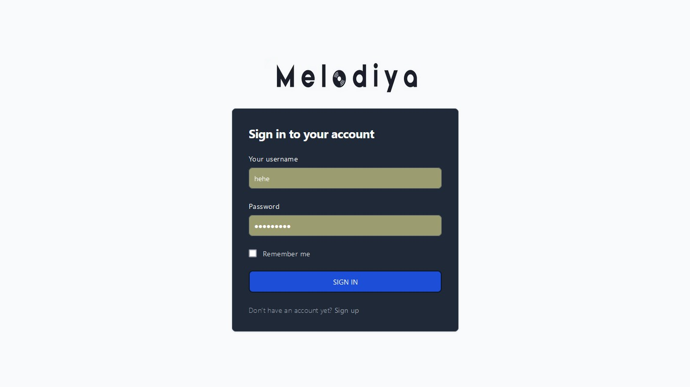
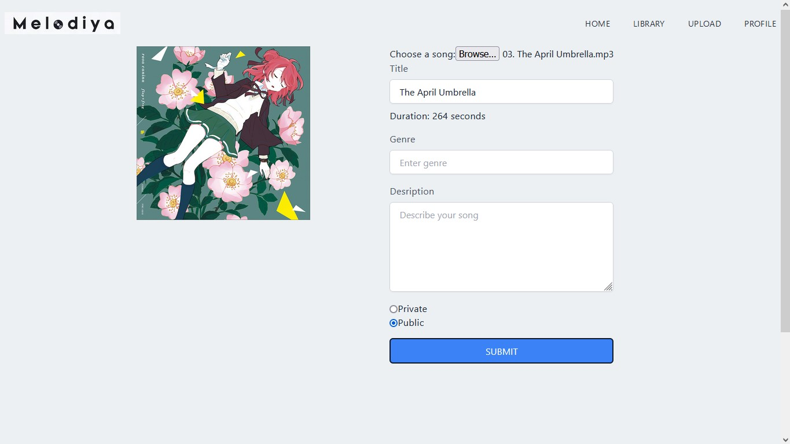
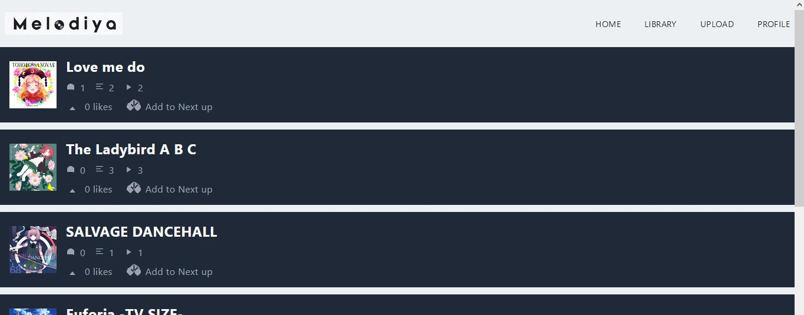

# Melodiya

Melodiya is a web-based music platform that allows users to discover, play, upload, and interact with songs. This project aims to provide a seamless music listening experience while incorporating essential features such as user authentication, song uploading, and commenting for now. More features like sorting, album creation, and a chat feature are still a work in progress.

This project uses Next.js for the frontend and Node.js with Express for the backend.

## Features

1. **Home Menu:** Users can access the site's home menu, where they can search for songs and play them. Although uploading and commenting on songs are restricted in this section, users can enjoy browsing and listening to a wide variety of tracks.

2. **Login Page:** User authentication is implemented through a login page. Users can securely create an account and log in to access additional features and personalize their experience.

3. **Song Upload:** Registered users can upload their own songs to the platform. This feature enables musicians and artists to share their original music with the Melodiya community. The uploaded songs are automatically analyzed to extract relevant metadata, such as the song title, artist name, and album artwork, providing a streamlined experience for users.

4. **Song Comments:** Users can comment on songs, fostering engagement and creating a sense of community. This allows listeners to express their thoughts, provide feedback, and connect with fellow music enthusiasts.

## Screenshots

Here are some screenshots of the Melodiya project:

## Libraries and Technologies Used

1. **Backblaze B2 Node:** The Backblaze B2 Node library is employed for storage purposes. It enables efficient and reliable storage of the uploaded songs, ensuring their availability for streaming and retrieval.

2. **MongoDB with Mongoose:** The project utilizes MongoDB as the database, and the Mongoose library provides an elegant and intuitive way to interact with the database from the Node.js application.

3. **JWT (JSON Web Tokens):** JWT is used for user authentication. It provides a secure and stateless way to authenticate and authorize users, ensuring that only authenticated users can access protected routes and features.

4. **Express:** Express.js is chosen as the web application framework to handle routing, middleware, and API endpoints. It simplifies the development process and enables the creation of robust and scalable web applications.

5. **bcrypt:** The bcrypt library is utilized for password hashing. It enhances the security of user passwords by transforming them into irreversible hashes, protecting user accounts from unauthorized access.

## Getting Started

To run the Melodiya project on your local machine, follow these steps:

1. Clone the repository: `git clone https://github.com/Retrospective/Melodiya.git`
2. Install the required dependencies by running `npm install` on both the "api" and "my-app" folders.
3. Configure the necessary environment variables, such as the database connection details and authentication secrets.
4. Ensure that MongoDB is running locally or update the connection details to connect to a remote MongoDB instance.
5. Launch the application with the command `npm run dev`.
6. Access the application by navigating to `http://localhost:3000` in your web browser.
